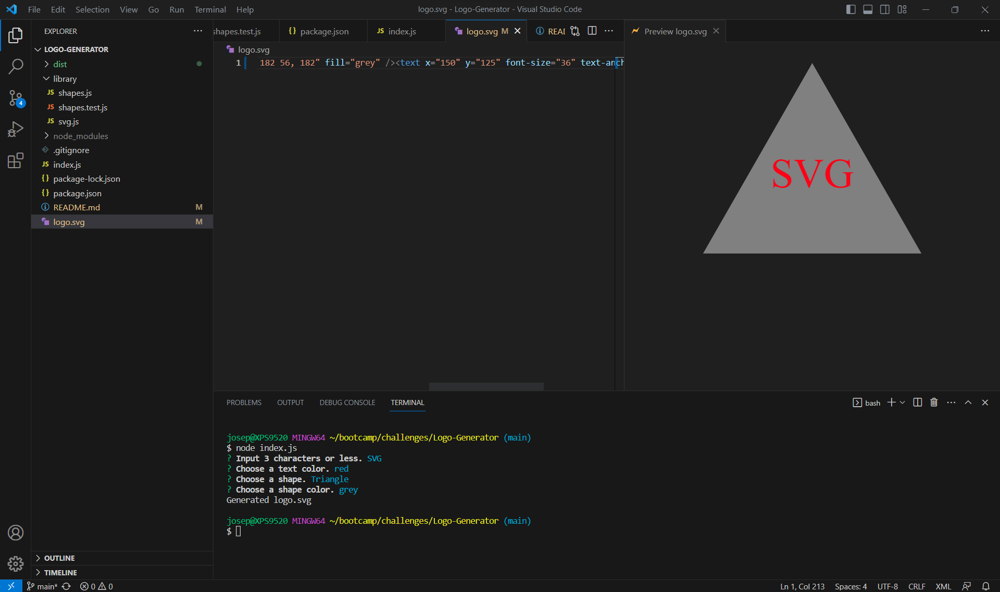

# Logo Generator
  

  ## Description
  This application allows the user to generate a logo using shapes, colors, and text

 - WHEN prompted for text
 - THEN up to three characters may be entered

 - WHEN prompted for the text color
 - THEN a color or hexadecimal number may be entered

 - WHEN prompted for a shape
 - THEN a list of shapes is presented: circle, triangle, and square

 - WHEN prompted for the shape's color
 - THEN a color or hexadecimal number may be entered

 - WHEN input for all prompts has been entered
 - THEN an SVG file is created named `logo.svg` and "Generated logo.svg" is printed in the command line

 - WHEN the `logo.svg` file is opened in a browser
 - THEN it is shown a 300x200 pixel image that matches the criteria entered

  ## Table of Contents
  - [Installation](#installation)
  - [Usage](#usage)

  - [Contributing](#contributing)
  - [Test](#test)
  - [Questions](#questions)

  ## Installation
  Via node.js and npm

  ## Usage
  This application can be used consistently and indefinitely

  

  ## Contributing
  Contribution unavailable at this time

  ## Test
  Via command prompt

  ## Questions
  Please email questions to joseph.s.foster@icloud.com.
  For additional works, please visit [https://github.com/joseph-s-foster]

  
